# Quick Start: 5 Minutes to Your First Task

Get productive with agentic AI in 5 minutes. For comprehensive setup and details, see the [Getting Started Guide](https://git.lab.smartsheet.com/community/sdlc-template/-/blob/main/docs/agentic-ai-training/07-getting-started.md).

---

## 🔧 Tool Options

> **Choose Your Implementation**: This workflow supports both **Roo** (XML-based mode switching) and **Claude Code** (Task delegation to agents). Both provide identical specialized role capabilities - choose whichever tool you prefer.

---

## ⚡ What You Need to Know

**Agentic AI = Specialized AI roles** instead of one AI doing everything.

**Key Concept**: Pick the right role for your task, trust delegation to specialists. Works the same whether you use Roo modes or Claude Code agents.

---

## 🎯 Quick Decision Tree

### "I need to..." → Which Role?

| I need to... | Use This Role | Roo Mode | Claude Code Agent |
|-------------|---------------|----------|-------------------|
| **Plan a new feature** | 🏗️ Architect | `architect` | `architect` |
| **Write documentation** | 📊 Spec Writer | `spec` | `spec-writer` |
| **Implement business logic** | 💻 Implementer | `code` | `implementer` |
| **Integrate an API** | 🔌 API Client Specialist | `api-client-code` | `api-client-specialist` |
| **Fix environment issues** | 🔧 Environment Troubleshooter | `dev-env` | `env-troubleshooter` |
| **Process code review feedback** | 🔄 MR Processor | `mr-actions` | `mr-processor` |
| **Coordinate complex projects** | 🎯 Orchestrator | `orchestrator` | general-purpose |
| **Set up a new developer** | 🔧 Environment Troubleshooter | `dev-env` | `env-troubleshooter` |

### Visual Decision Flow

```mermaid
%%{init: {'theme':'neutral'}}%%
graph TD
    A[What do you need?] --> B{Planning?}
    B -->|Yes| C[🏗️ Architect]
    B -->|No| D{Documentation?}
    D -->|Yes| E[📊 Spec]
    D -->|No| F{Environment Issue?}
    F -->|Yes| G[🔧 Dev Env]
    F -->|No| H{API Work?}
    H -->|Yes| I[🔌 API Client Code]
    H -->|No| J{Code Review?}
    J -->|Yes| K[🔄 MR Actions]
    J -->|No| L{Complex Project?}
    L -->|Yes| M[🎯 Orchestrator]
    L -->|No| N[💻 Code]

    style C fill:#fff9c4
    style E fill:#e1bee7
    style G fill:#b2dfdb
    style I fill:#f8bbd0
    style K fill:#ce93d8
    style M fill:#ffccbc
    style N fill:#c8e6c9
```



---

## ✅ First Steps Checklist

### Setup Verification

- [ ] Smartsheet Agentic SDLC template deployed to your project
- [ ] **Roo**: `.roomodes` file exists, VSCode reloaded, can see all 7 modes
- [ ] **Claude Code**: Agents available in Task interface
- [ ] Environment variables configured in `.env` (if using MR Processor or Orchestrator)

**Note**: Memory bank (`memory-bank/` directory) is automatically created by Architect role when first invoked.

### Your First Task

**Start Simple** - Try these in order:

1. **Test Architect Role**: "Explain the system architecture"
   - Verifies role is working (Roo: switch to `architect` mode; Claude Code: invoke `architect` agent)
   - Gets you familiar with your project structure

2. **Test Environment Troubleshooter**: "Verify my development environment is set up correctly"
   - Checks dependencies
   - Validates configuration

3. **Test Implementer**: "Show me the coding patterns we use"
   - Demonstrates project conventions
   - References guidance documents

### Where to Get Help

- **Role-specific issues**: Check `sdlc/.roo/rules-{mode-name}/` (Roo) or shared documentation in `sdlc/shared/`
- **Setup problems**: See [sdlc/README.md](../../README.md) troubleshooting
- **Conceptual questions**: Read the [comprehensive guide](README.md)
- **Community support**: Join Slack channels #internal-ai-tools or #guild-roo
- **Technical support**: Open an issue in the template repository

---

## ⚠️ Common Mistakes

### 1. Using the Wrong Role

**Problem**: Asking Implementer to fix environment errors

**Fix**: Use Environment Troubleshooter for environment issues - it diagnoses systematically. This applies to both Roo and Claude Code.

---

### 2. Memory Bank Auto-Creation

**Note**: Architect mode automatically creates the `memory-bank/` directory if it doesn't exist when invoked.

**Manual creation** (optional):
```bash
mkdir -p memory-bank
cd memory-bank
touch activeContext.md productContext.md systemPatterns.md
```

---

### 3. Blocking Delegation

**Problem**: Forcing Implementer to generate API clients instead of letting it delegate

**Fix**: Trust delegation - API Client Specialist reads actual specs, ensures correctness. Delegation works identically in both Roo and Claude Code.

---

## 🎓 Next Steps

### Learn More

- **[Agentic AI Cheatsheet](cheatsheet.md)** - One-page quick reference
- **[Comprehensive Training Guide](README.md)** - Deep dive into principles
- **[Smartsheet Agentic SDLC Documentation](../../sdlc.md)** - Technical system details

### Practice

1. **Week 1**: Use roles for simple tasks, observe delegation
2. **Week 2**: Try complex workflows, let Orchestrator coordinate
3. **Week 3**: Customize guidance documents for your project
4. **Week 4**: Extend with custom roles if needed (tool-specific)

### Remember

- **Trust delegation** - Specialists produce better results
- **Provide context** - Clear task descriptions get better outcomes
- **Review and iterate** - First attempt may not be perfect
- **Maintain memory banks** - Keep context files updated

---

**Ready to dive deeper?** Check out the [comprehensive training guide](README.md) for detailed explanations, real-world scenarios, and advanced topics.
