# project online Smartsheet Agentic SDLC

## Overview

The project online Smartsheet Agentic SDLC is a comprehensive collection of specialized AI-powered development modes designed for your specific project development. This system provides developers with intelligent assistants that understand your project patterns, architecture, and the entire development lifecycle.

## Table of Contents

1. [Introduction to Roo Modes](#introduction-to-roo-modes)
2. [project online Orchestrator - Your Primary Entry Point](#project-name-orchestrator---your-primary-entry-point)
3. [Complete Mode Directory](#complete-mode-directory)
4. [Mode Collaboration Workflows](#mode-collaboration-workflows)
5. [Deployment Instructions](#deployment-instructions)
6. [Mode Writer Integration](#mode-writer-integration)
7. [Getting Started Guide](#getting-started-guide)
8. [Development Resources](#development-resources)
9. [Troubleshooting](#troubleshooting)

---

## Introduction to Roo Modes

### What are Roo Modes?

Roo modes are specialized AI assistants that function as expert developers with deep knowledge in specific domains. Each mode operates as an intelligent agent with:

- **Specialized Knowledge**: Deep expertise in specific development areas (architecture, coding, debugging, API integration)
- **Context Awareness**: Understanding of your project architecture and patterns
- **Tool Access**: Full access to development tools (file editing, command execution, testing, browser automation)
- **Memory Management**: Sophisticated memory banking system to maintain project context across sessions

### How Roo Modes Work


### Key Benefits

- **Expert-Level Assistance**: Each mode provides specialist-level knowledge
- **Consistent Patterns**: All modes understand your project architecture
- **Efficient Workflows**: Automated task routing and coordination
- **Memory Continuity**: Project context preserved across mode switches
- **Quality Assurance**: Built-in best practices and validation

---

## project online Orchestrator - Your Primary Entry Point

The **🎯 project online Orchestrator** is your primary interface for project development. This mode serves as the intelligent coordinator that:

### Why Start with the Orchestrator?

1. **Intelligent Task Analysis**: Automatically analyzes your requests and routes to appropriate specialized modes
2. **Workflow Coordination**: Manages complex multi-step projects across different specialties
3. **Context Management**: Maintains project continuity as work moves between modes
4. **Dependency Management**: Ensures proper sequencing of tasks and handoffs
5. **JIRA Integration**: Optional task tracking with "What's next?" queries

### Core Capabilities

- **Project Breakdown**: Decomposes complex requirements into manageable subtasks
- **Mode Selection**: Routes tasks to the most appropriate specialist mode
- **Progress Tracking**: Monitors work across multiple modes and coordinates completion
- **Knowledge Transfer**: Ensures context and decisions are properly communicated between modes
- **Task Tracking**: Integrates with JIRA for automated task discovery and status updates

### Typical Orchestrator Workflows

```typescript
// Example: Complete feature development workflow
User Request: "Create a new user authentication system"
    ↓
Orchestrator Analysis: "This requires specification → implementation → testing"
    ↓
1. Route to project online Spec → Create specification
2. Route to project online Code → Implement feature
3. Route to project online API Client → Create any needed API clients
4. Coordinate testing and deployment
```

```typescript
// Example: JIRA-driven development
User Request: "What's next?"
    ↓
Orchestrator queries JIRA:
1. Gets current user, finds assigned/unassigned tasks
2. Claims priority task, enhances description if needed
3. Sets up git branch with personal/{username}/ID-description pattern
4. Routes to appropriate mode based on task status
```

---

## Complete Mode Directory

### 🏗️ project online Architect (`architect`)
**Role**: Strategic planning and system architecture design

**Use When**:
- Planning complex features or system changes
- Creating technical specifications
- Designing system architecture
- Breaking down large projects into phases

**Capabilities**:
- Strategic planning and system architecture design
- Technical requirements analysis and specification creation
- Project breakdown and milestone planning
- Risk assessment and mitigation strategy development
- Cross-functional coordination and communication

**File Access**: Can only edit Markdown files (`*.md`) - creates planning docs in `sdlc/docs/plans/`
**Memory Banks**: Uses automatic context detection for SDLC vs App work
**Delegation**: Delegates API client work and environment issues to specialists

---

### 🎯 project online Orchestrator (`orchestrator`)
**Role**: Multi-step project coordination and workflow management

**Use When**:
- Managing complex, multi-step projects
- Coordinating work between different specialized modes
- Breaking down large tasks into subtasks
- Handling complete development workflows
- Using "What's next?" queries with JIRA integration

**Key Features**:
- **JIRA Integration**: Task discovery, assignment claiming, status updates
- **Git Workflow Automation**: Standardized branching with personal/{username}/ID-description pattern
- **Mode Coordination**: Intelligent routing based on task status and requirements
- **Complete Development Lifecycle**: From planning through deployment

**Full Tool Access**: Read, edit, command, browser, MCP
**JIRA MCP Tools**: Complete integration via MCP Atlassian server

---

### 🔧 project online Dev Env (`project-online-dev-env`)
**Role**: Development environment setup and troubleshooting specialist

**Use When**:
- Setting up development environments for new developers
- Troubleshooting dependency installation problems
- Debugging development server startup issues
- Configuring development tools and linting
- Environment issues encountered by other modes

**Expertise Areas**:
- Development environment setup and package management
- Development tool installation and configuration
- Container runtime setup and management
- Environment variable configuration and .env file management
- project online SDLC modes deployment and troubleshooting
- Comprehensive ecosystem knowledge beyond project-specific setup

**File Access**: Configuration files, requirements, and documentation
**Integration**: References Dev Env.md + broad ecosystem troubleshooting knowledge
**Delegation Target**: ALL other modes delegate environment issues here

---

### 🔌 project online API Client (`project-online-api-client-code`)
**Role**: API client code generation with specification fidelity

**Use When**:
- Creating API clients from OpenAPI/Swagger specifications
- Implementing API authentication and request/response handling
- Generating typed models from API schemas
- Any API client implementation (automatically delegated by other modes)

**Core Principle**: API specification accuracy over human convenience

**Expertise Areas**:
- Deep parsing of OpenAPI/Swagger and REST API documentation
- Strongly-typed API client generation
- Comprehensive implementation with authentication and error handling
- Specification fidelity enforcement

**File Access**: API client implementations, schemas, and related tests only
**Delegation Target**: ALL other modes delegate API client work here
**Critical Rule**: ONLY mode that implements API clients (zero exceptions)

---

### 🔄 project online MR Actions (`project-online-mr-actions`)
**Role**: MR feedback analysis and implementation planning

**Use When**:
- Processing merge request feedback and reviewer comments
- Planning implementation of reviewer suggestions
- Understanding impact on project components
- Tracking MR feedback resolution progress

**Capabilities**:
- Git branch analysis and MR mapping
- MR feedback comprehension and categorization
- Change recommendation generation with implementation options
- Collaboration planning with other modes for feedback implementation

**File Access**: Documentation, specification files, and source code
**Git Platform Support**: Works with GitHub, GitLab, and other git platforms
**Integration**: Coordinates with Spec and Code modes for feedback resolution

---

### 📊 project online Spec (`project-online-spec`)
**Role**: Specification and documentation creation

**Use When**:
- Creating comprehensive project documentation
- Documenting API integrations and system architecture
- Writing technical specifications
- Generating quality-compliant documentation

**Core Features**:
- References `sdlc/docs/specs/` for project-specific templates and standards
- Creates specifications in `sdlc/docs/specs/` following established patterns
- Maintains consistency with project documentation standards
- Follows canonical documentation patterns

**Workflow Process**:
1. Check sdlc/docs/specs/ for templates and standards (including subdirectories)
2. Apply project-specific format and quality requirements
3. Create specifications in sdlc/docs/specs/ location
4. Follow established documentation patterns

**File Access**: Documentation files (Markdown format)
**Guidance Integration**: References sdlc/docs/specs/ recursively for templates
**Delegation**: Delegates API client work and environment issues to specialists

---

### 💻 project online Code (`project-online-code`)
**Role**: Complete project implementation

**Use When**:
- Implementing features based on specifications
- Creating application components and business logic
- Building testing suites and evaluation scenarios
- Configuration updates and deployment scripts

**Core Features**:
- References `sdlc/docs/code/` for coding standards and patterns (including subdirectories)
- Maintains consistency with project coding standards
- Delegates ALL API client work to API Client mode
- Comprehensive implementation with framework integration

**Implementation Scope**:
- Complete feature implementation with proper architecture
- Configuration updates and testing suites
- Documentation and implementation guides
- Business logic and framework integration (NOT API clients)

**Full Tool Access**: Read, edit, command
**Guidance Integration**: References sdlc/docs/code/ recursively for standards
**Critical Delegation**: MUST delegate API client work to API Client mode

---

## Mode Collaboration Workflows

### 1. Complete Feature Development Workflow

This is the most common workflow for creating new features:

```mermaid
sequenceDiagram
    participant User
    participant Orchestrator as 🎯 Orchestrator
    participant Spec as 📊 Spec
    participant Code as 💻 Code
    participant APIClient as 🔌 API Client
    participant DevEnv as 🔧 Dev Env

    User->>Orchestrator: "Create feature for user management"
    Orchestrator->>Spec: Create feature specification
    Spec->>Orchestrator: Specification complete
    Orchestrator->>Code: Implement feature based on spec
    Code->>APIClient: Generate API client for backend
    APIClient->>Code: API client ready
    Code->>Orchestrator: Implementation complete
    Orchestrator->>User: Feature ready for testing
```



**Step-by-Step Process**:
1. **Orchestrator**: Receives user request and analyzes requirements
2. **Spec Mode**: Creates detailed specification in sdlc/docs/specs/
3. **Code Mode**: Implements the complete feature using patterns from sdlc/docs/code/
4. **API Client Mode**: Generates any needed API clients (automatically triggered)
5. **Orchestrator**: Coordinates testing and deployment

### 2. Environment Setup Workflow

For new developers or troubleshooting environment issues:


### 3. MR Feedback Processing Workflow

When addressing code review feedback:


### 4. API Integration Workflow

When external API integration is needed:

```mermaid
sequenceDiagram
    participant User
    participant Orchestrator as 🎯 Orchestrator
    participant APIClient as 🔌 API Client
    participant Code as 💻 Code

    User->>Orchestrator: "Integrate with external API"
    Orchestrator->>APIClient: Generate API client from spec
    APIClient->>APIClient: Create typed client with auth
    APIClient->>Code: API client ready for integration
    Code->>Orchestrator: Integration complete
```



---

## Deployment Instructions

### Prerequisites

1. **VSCode with Roo Extension**: Ensure you have Roo properly installed and configured
2. **Project Repository**: Working in the correct project directory
3. **Proper Permissions**: Ability to modify `.roomodes` files

### Quick Deployment

The simplest way to deploy all project online modes:

```bash
# Navigate to the SDLC directory
cd sdlc

# Copy modes to parent directory
cp .roomodes ../

# Verify deployment
cd ..
grep -c "project-online-" .roomodes
# Should show your custom modes

# Reload VSCode window
# Use Cmd+Shift+P -> "Developer: Reload Window"
```

### Deployment Using Orchestrator Mode

If you have a Roo Orchestrator mode available:

1. Switch to **Orchestrator mode**
2. Use trigger phrase: `"deploy project-online modes"`
3. The Orchestrator will execute the deployment automatically
4. Follow the prompt to reload VSCode window

### Manual Deployment Verification

After deployment, verify modes are available:

```bash
# Check for project online modes
grep "slug: project-online-" .roomodes

# Expected output pattern:
# slug: project-online-spec
# slug: project-online-code
# slug: project-online-api-client-code
# slug: project-online-mr-actions
# slug: project-online-dev-env
```

### Post-Deployment Steps

1. **Reload VSCode**: Use `Cmd+Shift+P` → `Developer: Reload Window`
2. **Verify Mode Selector**: Check that modes appear in Roo mode selector
3. **Test Mode Switching**: Try switching to **🎯 project online Orchestrator**

---

## Complete Mode Directory

### 🏗️ project online Architect (`architect`)
**Role**: Strategic planning and system architecture design

**Use When**:
- Planning complex features or system changes
- Creating technical specifications
- Designing system architecture
- Breaking down large projects into phases

**Capabilities**:
- Strategic planning and system architecture design
- Technical requirements analysis and specification creation
- Project breakdown and milestone planning
- Risk assessment and mitigation strategy development
- Cross-functional coordination and communication

**File Access**: Can only edit Markdown files (`*.md`) - creates planning docs in `sdlc/docs/plans/`
**Memory Banks**: Uses automatic context detection for SDLC vs App work
**Delegation**: Delegates API client work and environment issues to specialists

---

### 🎯 project online Orchestrator (`orchestrator`)
**Role**: Multi-step project coordination and workflow management

**Use When**:
- Managing complex, multi-step projects
- Coordinating work between different specialized modes
- Breaking down large tasks into subtasks
- Handling complete development workflows
- Using "What's next?" queries with optional JIRA integration

**Key Routing Scenarios**:
- Feature Analysis → Routes to project online Spec mode
- Implementation → Routes to project online Code mode
- API Client Development → Routes to project online API Client mode
- Complete Feature Development → Orchestrates Spec → Code → Testing workflow

**JIRA Integration**:
- **Task Discovery**: "What's next?" queries automatically find tasks
- **Task Assignment**: Claims unassigned tasks to prevent conflicts
- **Description Enhancement**: Enhances task descriptions before routing to modes
- **Status Tracking**: Updates task status throughout development workflow
- **Git Integration**: Automated branching with personal/{username}/ID-description pattern

**Full Tool Access**: Read, edit, command, browser, MCP

---

### 🔧 project online Dev Env (`project-online-dev-env`)
**Role**: Development environment setup and troubleshooting specialist

**Use When**:
- Setting up development environments for new developers
- Troubleshooting dependency installation problems
- Debugging development server startup issues
- Configuring development tools and frameworks
- Environment issues encountered by other modes (automatic delegation)

**Expertise Areas**:
- Development environment setup and package management
- Development tool installation and configuration
- Container runtime setup and management
- Environment variable configuration and .env file management
- project online SDLC modes deployment and troubleshooting
- Comprehensive ecosystem knowledge (Python, Node.js, Java, databases, cloud services)

**Integration Features**:
- **References Dev Env.md**: Uses project-specific environment setup guide
- **Broad Ecosystem Knowledge**: Troubleshooting beyond just Dev Env.md content
- **Automatic .env Setup**: Creates .env from .env.sample and guides token configuration
- **Delegation Target**: ALL other modes delegate environment issues here

**File Access**: Configuration files, package manifests, and documentation only

---

### 🔌 project online API Client (`project-online-api-client-code`)
**Role**: API client code generation with specification fidelity

**Use When**:
- Creating API clients from OpenAPI/Swagger specifications
- Implementing API authentication and request/response handling
- Generating typed models from API schemas
- API client work (automatically delegated by other modes)

**Core Principle**: API specification accuracy over human convenience

**Expertise Areas**:
- Deep parsing of OpenAPI/Swagger and REST API documentation
- Strongly-typed API client generation
- Comprehensive implementation with authentication and error handling
- Specification fidelity enforcement

**Critical Architecture Rule**:
- **ONLY mode that implements API clients** (zero exceptions)
- **All other modes delegate** API client work to this specialist
- **Prevents hallucinations** and ensures specification compliance

**File Access**: API client implementations, service interfaces, types, and schemas

---

### 🔄 project online MR Actions (`project-online-mr-actions`)
**Role**: MR feedback analysis and implementation planning

**Use When**:
- Processing merge request feedback and reviewer comments
- Planning implementation of reviewer suggestions
- Understanding impact on project components
- Tracking MR feedback resolution progress

**Capabilities**:
- Git branch analysis and MR mapping
- Git platform API integration (GitHub, GitLab, etc.)
- MR feedback comprehension and categorization
- Change recommendation generation with implementation options
- Collaboration planning with other modes for feedback implementation

**Integration Features**:
- **Git Platform Agnostic**: Works with GitHub, GitLab, and other platforms
- **Complete Workflow**: From feedback analysis to implementation coordination
- **Mode Coordination**: Routes work to Spec and Code modes as needed

**File Access**: Documentation, specification files, and source code

---

### 📊 project online Spec (`project-online-spec`)
**Role**: Specification and documentation creation

**Use When**:
- Creating comprehensive project documentation
- Documenting API integrations and system architecture
- Writing technical specifications
- Generating quality-compliant documentation

**Core Features**:
- **References sdlc/docs/specs/**: Uses project-specific templates and standards (including subdirectories)
- **Creates specifications**: In sdlc/docs/specs/ following established patterns
- **Consistency enforcement**: Maintains standards across all project documentation
- **Template-driven**: Follows canonical documentation patterns

**Workflow Process**:
1. Check sdlc/docs/specs/ for templates and standards
2. Apply project-specific format and quality requirements
3. Create specifications in sdlc/docs/specs/ location
4. Follow established documentation patterns

**File Access**: Documentation files (Markdown format)
**Delegation**: Delegates API client work and environment issues to specialists

---

### 💻 project online Code (`project-online-code`)
**Role**: Complete project implementation

**Use When**:
- Implementing features based on specifications
- Creating application components and business logic
- Building testing suites and configuration
- Implementation work (NOT API client creation)

**Core Features**:
- **References sdlc/docs/code/**: Uses coding standards and patterns (including subdirectories)
- **Consistent Implementation**: Follows project-specific coding standards
- **Framework Integration**: Business logic and application component focus
- **Quality Assurance**: Comprehensive testing and validation

**CRITICAL API Client Delegation**: Automatically delegates all API client tasks to project online API Client mode

**Implementation Scope**:
- Complete feature implementation with proper architecture
- Business logic and application component implementation
- Configuration files and deployment scripts
- Testing suites and validation code
- Documentation and implementation guides

**NOT for API Clients**: Business logic, UI components, general application code only

**Full Tool Access**: Read, edit, command
**Guidance Integration**: References sdlc/docs/code/ recursively for standards

---

## Mode Collaboration Workflows

### 1. Complete Feature Development Workflow



```mermaid
sequenceDiagram
    participant User
    participant Orchestrator as 🎯 Orchestrator
    participant Spec as 📊 Spec
    participant Code as 💻 Code
    participant APIClient as 🔌 API Client
    participant DevEnv as 🔧 Dev Env

    User->>Orchestrator: "Create new feature"
    Orchestrator->>Spec: Analyze requirements, create specification
    Spec->>Orchestrator: Specification complete (created in sdlc/docs/specs/)
    Orchestrator->>Code: Implement feature based on spec
    Code->>APIClient: Generate API client for backend (if needed)
    APIClient->>Code: API client ready
    Code->>Orchestrator: Implementation complete
    Orchestrator->>User: Feature ready for testing
```

### 2. JIRA-Driven Development Workflow

```mermaid
sequenceDiagram
    participant User
    participant Orchestrator as 🎯 Orchestrator
    participant JIRA
    participant Spec as 📊 Spec
    participant Code as 💻 Code

    User->>Orchestrator: "What's next?"
    Orchestrator->>JIRA: Query tasks (GET /sheets/ID)
    JIRA->>Orchestrator: Return filtered tasks
    Orchestrator->>Orchestrator: Claim priority task, enhance description
    Orchestrator->>Spec: Create specification for claimed task
    Spec->>Code: Implement based on specification
    Code->>Orchestrator: Implementation complete
    Orchestrator->>JIRA: Update task status
```



### 3. Environment Issue Resolution Workflow

```mermaid
sequenceDiagram
    participant User
    participant AnyMode as Any Mode
    participant DevEnv as 🔧 Dev Env

    User->>AnyMode: Request work
    AnyMode->>AnyMode: Command fails ("ModuleNotFoundError")
    AnyMode->>DevEnv: Delegate environment issue
    DevEnv->>DevEnv: Diagnose and fix environment
    DevEnv->>AnyMode: Environment fixed, return control
    AnyMode->>AnyMode: Retry original command
    AnyMode->>User: Work completed successfully
```



---

## Deployment Instructions

### Using Deployment Commands

Using the [`deployment.yaml`](deployment.yaml) configuration:

```bash
# Execute deployment commands
cp .roomodes ../
echo 'project online modes deployed successfully. Please manually reload VSCode window'

# Verification (optional)
cd .. && grep 'slug: project-online-' .roomodes
cd .. && python3 -c "import yaml; yaml.safe_load(open('.roomodes', 'r'))" && echo 'YAML syntax valid'
```

### Troubleshooting Deployment

**Modes Not Appearing:**
- Restart VSCode completely
- Check `.roomodes` file exists in parent directory
- Validate YAML syntax: `python -c "import yaml; yaml.safe_load(open('.roomodes', 'r'))"`

**Syntax Errors:**
- Compare against working [`.roomodes`](.roomodes) example
- Check indentation and structure
- Ensure no tab characters (use spaces only)

---

## Getting Started Guide

### For New Developers

#### Step 1: Environment Setup

1. **Clone Repository**:
```bash
git clone <your-project-repository>
cd <your-project-directory>
```

2. **Deploy project online Modes**:
```bash
cd sdlc
cp .roomodes ../
cd ..
```

3. **Reload VSCode**:
   - Use `Cmd+Shift+P` → `Developer: Reload Window`
   - Verify project online modes appear in Roo mode selector

#### Step 2: Verify Development Environment

1. **Switch to project online Dev Env Mode**:
   - Select "🔧 project online Dev Env" from Roo mode selector
   
2. **Run Environment Check**:
   - Request: "Set up environment" or "Check my development environment"
   - The mode will create .env file and guide through token setup

3. **Follow Setup Guidance**:
   - Dev Env mode will guide you through any missing setup steps
   - Refer to [`Dev Env.md`](Dev%20Env.md) for detailed setup instructions

#### Step 3: Start with the Orchestrator

1. **Switch to project online Orchestrator**:
   - Select "🎯 project online Orchestrator" from mode selector

2. **Introduce Your Goals**:
   - "I'm new to project online development and want to understand the system"
   - "I need to create a feature for [specific functionality]"
   - "What's next?" (if using JIRA integration)

3. **Follow Orchestrator Guidance**:
   - The Orchestrator will analyze your needs
   - Route you to appropriate specialized modes
   - Coordinate your learning and development process

### For Experienced Developers

#### Direct Mode Usage

**Creating Specifications**:
- Switch directly to **📊 project online Spec** mode
- References templates in sdlc/docs/specs/
- Creates specifications in sdlc/docs/specs/

**Implementing Features**:
- Switch to **💻 project online Code** mode  
- References patterns in sdlc/docs/code/
- Automatically delegates API client work

**API Integration**:
- API client work is automatically handled by **🔌 project online API Client** mode
- Provide OpenAPI specification or API documentation
- Receive typed API client implementation

#### Advanced Workflows

**Multi-Component Development**:
1. Start with **🎯 project online Orchestrator**
2. Describe complex multi-component feature
3. Let Orchestrator coordinate specialist modes
4. Review and integrate completed components

**JIRA-Driven Development**:
1. Configure JIRA integration in .env
2. Use **🎯 project online Orchestrator** with "What's next?" queries
3. Let Orchestrator discover, claim, and route tasks automatically

---

## Development Resources

### Documentation Structure

- **[sdlc/docs/code/](docs/code/)**: Code mode references for standards and patterns
- **[sdlc/docs/specs/](docs/specs/)**: Spec mode references for templates and examples  
- **[sdlc/docs/api-reference/](docs/api-reference/)**: API documentation
- **[sdlc/docs/plans/](docs/plans/)**: Architect creates planning documents here

### Key Files and Directories

```
sdlc/
├── .roomodes                     # Mode definitions
├── deployment.yaml              # Deployment configuration  
├── Dev Env.md                  # Environment setup guide (modes reference this)
├── .roo/                       # Mode-specific rules and configurations
│   ├── deployment-instructions.xml
│   ├── cleanup-tool-names.sh
│   └── rules-[mode-name]/
├── docs/                       # Comprehensive documentation
│   ├── code/                   # Code mode guidance
│   ├── specs/                  # Spec mode guidance
│   ├── api-reference/
│   └── plans/                  # Planning documents
└── memory-bank/               # SDLC-specific memory bank
    ├── productContext.md
    ├── activeContext.md
    ├── systemPatterns.md
    ├── decisionLog.md
    └── progress.md
```

### Memory Bank System

The project online Smartsheet Agentic SDLC uses **segmented memory banks**:

**SDLC Memory Bank** (`sdlc/memory-bank/`):
- Used for Roo mode development and deployment
- Tracks SDLC tooling, mode architecture, and integration
- Maintains context for building development tools

**Main App Memory Bank** (`memory-bank/`):
- Used for project online application development  
- Tracks business logic, user features, and core architecture
- Maintains context for application feature development

**Automatic Context Detection**: Modes automatically choose the correct memory bank based on work type.

---

## Troubleshooting

### Mode Selection Issues

**Problem**: Modes don't appear in selector after deployment
**Solutions**:
1. Restart VSCode completely: `Cmd+Shift+P` → `Developer: Reload Window`
2. Verify `.roomodes` exists in parent directory: `ls -la .roomodes`  
3. Check YAML syntax: `python -c "import yaml; yaml.safe_load(open('.roomodes', 'r'))"`
4. Compare with working [`.roomodes`](.roomodes) file

### Mode Configuration Errors

**Problem**: Mode fails to load or behaves incorrectly
**Solutions**:
1. Check VSCode developer console for errors
2. Validate mode configuration structure
3. Verify file restriction patterns are correct
4. Test with simpler requests first

### Memory Bank Context Issues  

**Problem**: Modes lose context between sessions or use wrong memory bank
**Solutions**:
1. Verify memory bank files exist in correct locations
2. Check memory bank file permissions
3. Explicitly state context ("I'm working on SDLC tooling" vs "I'm working on app features")
4. Use UMB (Update Memory Bank) command to refresh context

### Development Environment Issues

**Problem**: Development environment fails to start or has missing dependencies
**Solutions**:
1. Switch to **🔧 project online Dev Env** mode
2. Request comprehensive environment check: "Set up environment"
3. Follow mode's systematic troubleshooting guidance
4. Refer to [`Dev Env.md`](Dev%20Env.md) for detailed setup

### API Integration Problems

**Problem**: API client generation fails or produces incorrect code
**Solutions**:
1. Verify OpenAPI specification is valid
2. Ensure API client work is delegated to **🔌 project online API Client** mode
3. Check API specification fidelity requirements
4. Test with simpler API endpoints first

---

## Getting Help

### Mode-Specific Help

**General Guidance**: Start with **🎯 project online Orchestrator**
- Analyzes your needs and routes to appropriate specialist
- Coordinates complex workflows across modes
- Provides project-level guidance and planning
- Handles JIRA integration for task tracking

**Specific Mode Help**:
- **Environment Issues**: 🔧 project online Dev Env
- **Planning & Architecture**: 🏗️ project online Architect  
- **Specifications**: 📊 project online Spec
- **Implementation**: 💻 project online Code
- **API Integration**: 🔌 project online API Client
- **MR Feedback**: 🔄 project online MR Actions

### Documentation Resources

- **Environment Setup**: [`Dev Env.md`](Dev%20Env.md)
- **Code Standards**: [`docs/code/`](docs/code/)
- **Specification Templates**: [`docs/specs/`](docs/specs/)
- **API Documentation**: [`docs/api-reference/`](docs/api-reference/)

### Community and Support

1. **Start Simple**: Begin with basic requests to understand mode capabilities
2. **Use Orchestrator**: Let the Orchestrator coordinate complex workflows  
3. **Follow Patterns**: Reference existing implementations in docs/
4. **Iterative Development**: Build and test incrementally
5. **Memory Bank Updates**: Use UMB commands to maintain context

---

## Summary

The project online Smartsheet Agentic SDLC provides a comprehensive, AI-powered development environment for your specific project development. By starting with the **🎯 project online Orchestrator** and leveraging specialized modes for specific tasks, developers can efficiently create, test, and deploy sophisticated features while maintaining high code quality and architectural consistency.

**Key Success Factors**:
- **Start with Orchestrator** for complex projects or "What's next?" queries
- **Use Specialist Modes** for focused tasks  
- **Follow Established Patterns** from sdlc/docs/code/ and sdlc/docs/specs/
- **Maintain Memory Bank Context** across sessions
- **Leverage Delegation** (API clients → specialist, environment issues → Dev Env)
- **Test Incrementally** throughout development

**Architecture Highlights**:
- **Segmented Memory Banks**: Automatic context detection prevents confusion
- **Complete Delegation**: API clients and environment issues handled by specialists
- **Mode Guidance System**: Modes reference project-specific standards and templates
- **Optional JIRA Integration**: Complete task tracking with automated workflows

The system is designed to grow with your expertise—from guided workflows for new developers to direct specialist mode usage for experienced teams.